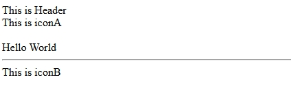
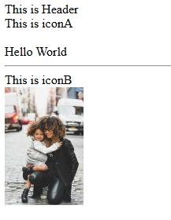

# React คืออะไร?
React คือ library สำหรับ web และ native user interfaces ที่ใช้สำหรับการพัฒนา web application ฝั่ง Frontend

- มอง web app ทั้งหมดเป็น component based
- ใช้ภาษา JSX เป็น based ในการจัดการ style และ component (เพิ่มความสามารถของ javascript ให้จัดการฝั่ง html ไปร่วมกันได้) = จริงๆแล้วมันคือ based javascript
- แถม support ทุก platform ด้วย
- ใครที่รู้จัก Vue มา มีสถานะที่คล้ายๆกัน คือเป็น library Frontend เหมือนกัน แต่ไอเดียการพัฒนาจะเป็นไปในคนละแบบกัน

#### 1. Component-Based:
- React ใช้แนวคิดการแบ่งส่วนประกอบของ UI เป็น Components
- แต่ละ Component สามารถนำกลับมาใช้ซ้ำได้
- ทำให้การจัดการและบำรุงรักษาโค้ดทำได้ง่ายขึ้น

#### 2. Virtual DOM:
- React ใช้ Virtual DOM เพื่อเพิ่มประสิทธิภาพในการ render
- เมื่อข้อมูลเปลี่ยน React จะเปรียบเทียบ Virtual DOM กับ Real DOM
- อัพเดทเฉพาะส่วนที่มีการเปลี่ยนแปลงจริงๆ ทำให้เว็บไซต์ทำงานได้เร็วขึ้น

#### 3. One-Way Data Flow:
- ข้อมูลไหลในทิศทางเดียวจาก Parent ไปยัง Child Components
- ทำให้การติดตามการเปลี่ยนแปลงของข้อมูลและการแก้บัคทำได้ง่าย

#### 4. JSX:
- ใช้ JSX ซึ่งเป็นส่วนขยายของ JavaScript
- ช่วยให้เขียน UI components ได้ง่ายขึ้นโดยใช้ syntax คล้าย HTML
- สามารถแทรก JavaScript expressions ลงใน JSX ได้


# การติดตั้งและเริ่มต้นใช้งาน React

## การสร้าง Project React
1. ไปที่ [Vite](https://vite.dev/guide/) - Vite เป็น package manager ที่ใช้สำหรับสร้างโปรเจค (ต้องติดตั้ง Node.js ก่อน)
2. ใช้คำสั่งใน Terminal: 
```bash
npm create vite@latest ชื่อโปรเจค -- --template react
```

### ขั้นตอนการติดตั้ง:
1. ระบบจะถามชื่อโปรเจค (Project name)
2. เลือก Framework เป็น React
3. เลือก Variant (JavaScript หรือ TypeScript)
4. ติดตั้ง dependencies: `npm install`
5. รันโปรเจค: `npm run dev`
6. เข้าเว็บที่ Local: http://localhost:5173/

.png>)

## โครงสร้างพื้นฐานของ Component
### การสร้าง Component แบบพื้นฐาน
```jsx
import './App.css'

function App() {
  return (
    <>
      <div>
        Hello World
      </div>
    </>
  )
}

export default App
```

### การใช้งาน Multiple Components
1. Single Component Export:
```jsx
// Header.jsx
export default function Header() {
    return (
        <div>
            This is Header
        </div>    
    )
}

// App.jsx
import Header from './components/header.jsx'

function App() {
    return (
        <div>
            <Header />
            Hello World
        </div>
    )
}
```
จะได้ผลลัพท์แบบนี้ กรณีที่ มีComponents เดียวในไฟล์


2. Multiple Components Export:
```jsx
// icon.jsx
export function IconA() {
    return (
        <div>
            This is iconA
        </div>    
    )
}

export function IconB() {
    return (
        <div>
            This is iconB
        </div>    
    )
}

// App.jsx
import Header from './components/header.jsx'
import { IconA(ชื่อcomponents),IconB } from './components/icon.jsx'

function App() {

  return (
      <div>
        <Header />
        <IconA />
        <br />
        Hello World
        <hr />
        <IconB />
      </div>
  )
}
```
จะได้ผลลัพท์แบบนี้ 



### การใช้งาน Image Component
```jsx
export default function Image({ imageUrl }) {
    return (
            <>
                
            </>
    )
}
```

คำอธิบายสั้น ๆ:
- ฟังก์ชัน `Image` เป็น Function Component ที่รับ `props` แบบ destructuring (`{ imageUrl }`).
- `imageUrl` คือ prop ที่ใช้ส่ง URL ของรูปมาจาก parent component (เช่น `App`).
- ใน component นี้ใช้ `` เพื่อแสดงรูป โดยกำหนดความกว้างเป็น 100px.
- มีการใช้ Fragment `<>...</>` รอบ `` แต่ในกรณีนี้ไม่จำเป็นเพราะ `` เป็น element เดียว — สามารถลบ Fragment ได้เพื่อให้โค้ดกระชับขึ้น.

การนำ `Image` มาใช้ใน `App.jsx` :
```jsx
import Image from './components/image.jsx'

function App() {
    return (
        <div>
            {/* ...components อื่นๆ ... */}
            <Image imageUrl='https://picsum.photos/200/300' />
        </div>
    )
}

export default App
```
ผลลัพท์



ข้อควรสังเกตและคำแนะนำ:
- ควรใส่ `alt` ให้ `` เสมอ เพื่อ accessibility และ SEO: ``.
- ถ้าต้องการให้รูปตอบสนองขนาดหน้าจอ (responsive) แนะนำใช้ CSS (เช่น `max-width:100%` และกำหนดความกว้างผ่าน class) แทนการใส่ `width` ตรงๆ.
- การโหลดรูปจาก URL ภายนอก (เช่น `picsum.photos`) อาจมีผลกับ performance — ควรพิจารณาการปรับขนาด/เก็บแคช หรือโหลดแบบ lazy (เช่น `loading="lazy"`).
- หากต้องการรับ props เพิ่มเติม (เช่น `alt`, `className`, `style`) สามารถส่งเข้ามาและกระจายไปยัง `` ด้วย spread operator: `function Image({ imageUrl, ...rest }) { return  }`.

`prop-types` เป็นแค่ไลบรารีเสริมที่ใช้ตรวจสอบชนิดของ props ตอน runtime (แสดงเป็น warning ใน console) ใช้คำสั่ง
 ```
 npm install prop-types
 ```
 ```jsx
Func img(){.....}

Image.propTypes = {
  imageUrl: PropTypes.string // กำหนดให้ imageUrl ต้องเป็นสตริง
}
 ```


## ข้อควรรู้:
- ไฟล์นามสกุล .jsx 1 ไฟล์ควรมี component หลักเพียงตัวเดียว
- การ export แบบ default ใช้สำหรับ component หลัก
- การ export แบบธรรมดาใช้สำหรับ multiple components
- ชื่อ Component ต้องขึ้นต้นด้วยตัวพิมพ์ใหญ่เสมอ

### การทำ CSS ใน React Component
การจัดการสไตล์ใน React มีหลายแนวทาง ขึ้นอยู่กับขนาดโปรเจคและความต้องการเรื่อง scope / reusability:

1) ไฟล์ CSS ธรรมดา (global CSS)

```jsx
// App.jsx
import './App.css';

function App(){
    return <div className="container">Hello</div>
}
```

- ใช้ `className` แทน `class` ใน JSX
- เหมาะกับโปรเจคเล็กหรือสไตล์ที่ต้องแชร์ทั่วทั้งแอป

2) CSS Modules (scoped CSS)

ไฟล์ตั้งชื่อเป็น `Component.module.css` แล้ว import เป็น object:

```jsx
// Button.module.css
.btn { background: blue; color: white }

// Button.jsx
import styles from './Button.module.css'

export default function Button(){
    return <button className={styles.btn}>Click</button>
}
```

- ข้อดี: class ถูก scope ให้เฉพาะ component นั้น ๆ (ลดปัญหา naming collision)

3) Inline styles (style attribute)

```jsx
<div style={{ color: 'red', fontSize: 16 }}>Hello</div>
```

- ดีสำหรับสไตล์ที่ขึ้นกับ props หรือคำนวณค่า runtime
- ข้อเสีย: ไม่รองรับ pseudo-classes (:hover) หรือ media queries โดยตรง

4) CSS-in-JS / Styled Components

ใช้ไลบรารีอย่าง `styled-components` หรือ `@emotion/styled` เพื่อสร้าง styled component:

```jsx
// ต้องติดตั้ง: npm install styled-components
import styled from 'styled-components'

const Button = styled.button`
    background: palevioletred;
    color: white;
`;

export default function App(){
    return <Button>Click</Button>
}
```

- ข้อดี: theme, dynamic props, และ scoping ดีเยี่ยม เหมาะกับโปรเจคใหญ่

5) เทคนิคและคำแนะนำปฏิบัติ
- ใส่ `alt` ให้ `` เสมอ เพื่อ accessibility
- หลีกเลี่ยงการใส่ `width`/`height` แบบ fixed ถ้าอยากให้ responsive — ใช้ CSS (`max-width:100%`) แทน
- ถ้ามี class หลายตัว ใช้ template literals หรือไลบรารี `classnames` เพื่อจัดการ conditionally classes
    - ตัวอย่าง: `className={
            `${styles.active} ${isLarge ? styles.large : ''}`
        }`
- สำหรับ props ที่ส่งเข้า component แล้วกระจายด้วย spread (`{...rest}`) ระวังอย่าส่ง props ที่ไม่ควรลงใน DOM (เช่น internal flags)
- สำหรับทีมใหญ่: พิจารณาใช้ CSS Modules หรือ styled-components พร้อม linting เพื่อความสอดคล้อง

# React Component / Props

## Component คืออะไร
Component คือส่วนประกอบย่อยของ UI ที่สามารถนำกลับมาใช้ซ้ำได้ แบ่งเป็น 2 แบบ:

1. Function Component:
```jsx
function Greeting(props) {
    return <h1>Hello, {props.name}</h1>;
}
```

2. Class Component:
```jsx
class Greeting extends React.Component {
    render() {
        return <h1>Hello, {this.props.name}</h1>;
    }
}
```

## Props คืออะไร
Props (Properties) คือข้อมูลที่ส่งจาก Parent Component ไปยัง Child Component:

- เป็น Read-only (ไม่สามารถแก้ไขได้ใน component ที่รับ props)
- ส่งได้หลายรูปแบบ (ข้อความ, ตัวเลข, object, function)
- ใช้เพื่อทำให้ component มีความยืดหยุ่น สามารถปรับเปลี่ยนการแสดงผลได้

ตัวอย่างการใช้ Props:
```jsx
// Parent Component
function App() {
    return <UserCard name="John" age={25} />;
}

// Child Component
function UserCard(props) {
    return (
        <div>
            <h2>{props.name}</h2>
            <p>Age: {props.age}</p>
        </div>
    );
}
```

## การส่งผ่าน Props
1. แบบปกติ:
```jsx
<UserCard name="John" age={25} />
```

2. แบบ Spread Operator:
```jsx
const userInfo = { name: "John", age: 25 };
<UserCard {...userInfo} />
```

3. แบบ Children Props:
```jsx
<Card>
    <h1>This is children content</h1>
</Card>
```

## ข้อควรระวัง
1. Props เป็น Read-only ห้ามแก้ไขค่าโดยตรง
2. ควรกำหนด Default Props เสมอ
3. ควรตรวจสอบ Props ด้วย PropTypes
4. Props ที่เป็น Object หรือ Array ควรระวังเรื่อง Reference

# Condition / Loop

## ตัวอย่างการใช้ Condition (if/else) ใน React Component

### Checkbox Component
```jsx
export default function Checkbox({ text, isChecked }) {
    let ResultCheckbox = ''
    if (isChecked) {
        ResultCheckbox = (
            <div>{ text } is done</div>
        )
    } else {
        ResultCheckbox = (
            <div>{ text } is in progress</div>
        )
    }
    return (
        <>
            { ResultCheckbox }
        </>
    )
}
```

**อธิบาย:**
- ตัวอย่างนี้ใช้ if/else เพื่อเลือกผลลัพธ์ที่จะแสดงในตัวแปร `ResultCheckbox` ตามค่า prop `isChecked`
- ถ้า `isChecked` เป็น true จะแสดงข้อความ "is done" ถ้าไม่ใช่จะแสดง "is in progress"
- การใช้ตัวแปรช่วยเก็บ JSX ก่อน return ทำให้โค้ดอ่านง่ายขึ้น

**แนวทางอื่นที่นิยม:**
- สามารถใช้ ternary operator ใน JSX ได้ เช่น
```jsx
return (
  <div>{text} {isChecked ? 'is done' : 'is in progress'}</div>
)
```

## ตัวอย่างการใช้ Loop (map) ใน React
```jsx
function TodoList({ items }) { //items เป็นอาร์เรย์
  return (
    <ul>
      {items.map((item, idx) => (
        <li key={idx}>{item}</li>
      ))}
    </ul>
  )
}
```
- ใช้ `.map()` เพื่อวนลูปแสดงรายการใน array
- ควรใส่ prop `key` ที่ unique ให้กับแต่ละ element ใน list

# React Hook สำหรับจัดการ state

React มี Hooks เพื่อจัดการ lifecycle และ state ใน Function Components — ตัวที่ใช้บ่อยที่สุดสำหรับ state คือ `useState`.

## useState (พื้นฐาน)
- นิยาม: `useState` ให้คุณเพิ่ม local state ใน Function Component
- รูปแบบ: `const [state, setState] = useState(initialValue)`

ตัวอย่าง (Counter) — แสดงการใช้ `useState` ร่วมกับปุ่ม `onClick`:
```jsx
import { useState } from 'react'

function Counter() {
    const [count, setCount] = useState(0) // กำหนด initial state เป็น 0

    // ฟังก์ชัน handler แบบแยกออกมา (อ่านง่ายและทดสอบง่าย)
    const increment = () => setCount(prev => prev + 1)
    const reset = () => setCount(0)

    return (
        <div>
            <h3>Count: {count}</h3>
            <button onClick={increment}>Increment</button>
            <button onClick={reset}>Reset</button>
        </div>
    )
}

export default Counter
```

คำอธิบายสั้น ๆ:
- `useState(0)` คืนค่าเป็นคู่ `[state, setState]` — `state` คือค่าปัจจุบัน, `setState` เป็นฟังก์ชันที่ใช้เปลี่ยนค่า
- ใน `onClick` เราเรียก `setCount` เพื่ออัปเดต state เมื่อผู้ใช้คลิกปุ่ม
- ใช้รูปแบบ functional update (`setCount(prev => prev + 1)`) เพื่อป้องกันปัญหา stale state เมื่ออาจมีการเรียกซ้อนกันหลายครั้ง

## การจัดการ state ที่เป็น object หรือหลายค่า
เมื่อ state เป็น object อย่าลบค่าที่มีอยู่โดยไม่ได้ตั้งใจ — ให้ใช้ spread เพื่อรักษาค่าที่เหลือ:

```jsx
function Profile() {
    const [user, setUser] = useState({ name: 'Guest', age: 0 })

    const updateName = (newName) => {
        setUser(prev => ({ ...prev, name: newName }))
    }

    return (
        <div>
            <div>{user.name} ({user.age})</div>
            <button onClick={() => updateName('John')}>Set name John</button>
        </div>
    )
}
```

## ข้อควรรู้และ best practices
- `setState` ไม่ได้เปลี่ยนค่าแบบ synchronous เสมอไป — React อาจ batch การอัปเดตและ re-render ภายหลัง
- ถ้าอัปเดตใหม่ขึ้นอยู่กับค่าก่อนหน้า ให้ใช้ functional update (`setState(prev => ...)`)
- หลีกเลี่ยงการเก็บข้อมูลที่ใหญ่หรือซับซ้อนเกินไปใน state เดียว — แบ่งเป็นหลาย state หรือใช้ reducer (`useReducer`) เมื่อ logic ซับซ้อน
- อย่าใส่ side-effects ในตัว setter หรือใน render — ใช้ `useEffect` สำหรับ side-effects

ตัวอย่างรวม: counter แบบหนึ่งบรรทัด (ternary) และป้องกันการลดค่าติดลบ
```jsx
function SafeCounter(){
    const [count, setCount] = useState(0)
    return (
        <div>
            <div>{count}</div>
            <button onClick={() => setCount(c => c + 1)}>+</button>
            <button onClick={() => setCount(c => Math.max(0, c - 1))}>-</button>
        </div>
    )
}
```

# React router (React router DOM)
